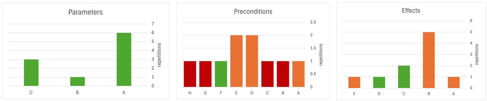

# Advanced Topics in Natural Language Processing - Final Project

This work is based on the paper: [Leveraging Pre-trained Large Language Models to Construct and Utilize World Models for Model-based Task Planning](https://guansuns.github.io/pages/llm-dm).

And the code is based on the repository: [LLMs-World-Models-for-Planning](https://github.com/GuanSuns/LLMs-World-Models-for-Planning)


## Experiment 1: PDDL task decomposition
In the paper, a single query was made for each new action, here we propose to break down the task into smaller sub-tasks. The task decomposition is done by the following steps:
1. Generate the parameters for the action.
2. Generate the preconditions for the action.
3. Generate the effects for the action.

In order to run the task decomposition, run the following command:
```bash
python construct_action_model_by_steps.py
```
The results are stored in the `anthropic/results/by_steps` folder.

### Experiment settings:
* Domain - household
* Model - claude-3.5
* No syntax validation was applied
### Results:


## Experiment 2: Parametric Knowledge Influence
In the original paper the experiments included 3 domains: 'logistics', 'tyreworld' and 'household' where the first 2 are well known benchmarks for planning while the last one is created by the authors.
Here we aim to isolate the influence of the parametric knowledge on the performance of the model. For that reason we created a new domain called 'library' which is a modified version of the 'logistics' domain. Here we altered the domain description while keeping the same number of actions and objects and relations between them.

In order to run the experiment, run the following command:
```bash
python construct_action_model.py
```
note: to change the domain, change the `domain` variable in the `construct_action_model.py` file.

### Experiment settings:
* Domain - library and logistics
* Model - GPT-4

### Results:
As in the paper we used the same metrics to evaluate the performance of the model.
* Library domain: 13 mistakes
* Logistics domain: 9 mistakes

## Experiment 2.5: Variance of Answers in the New Domain
Does parametric knowledge (known domains) affects the “self-confidence” of the LLM?

We ran the following 3 domains: 'library', 'logistics' and 'tyreworld' twice each, and compared the differences in the PDDL output between each run.

### Experiment settings:
* Domains - library, logistics, tyreworld
* Model - claude-3.5

### Results:


Here we can see that the modified domain 'library' has the highest variance in the output, while the 'logistics' and 'tyreworld' domains have a much lower variance, as expected.

## Experiment 3: Variance of the Suggested Method
We tested the variance of the answers of the system by using the same prompt for one of the most difficult actions for 10 times and looked for the difference in the answers.
Here we divided the evaluation into the three parts of the PDDL program for an action: parameters, preconditions and effects.

### Experiment settings:
* Domain - household
* Action - 'Heat Food with a Microwave'
* Model - GPT-4o

### Results:

Each bin represents the number of occurrences for unique answer.
The color indicate the number of mistakes per answer, such that:

Green - 0-1 mistakes,
orange - 2-4 mistakes,
red - 5-6 mistakes


